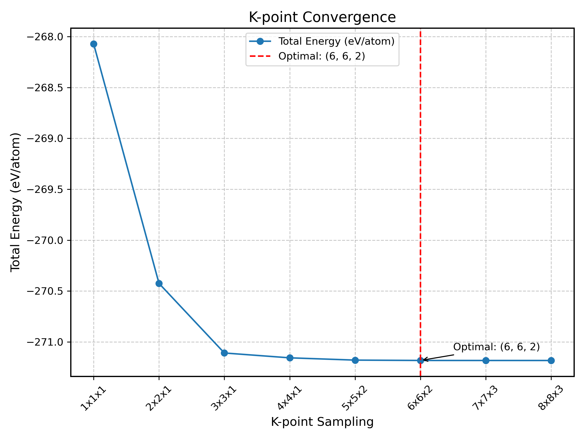
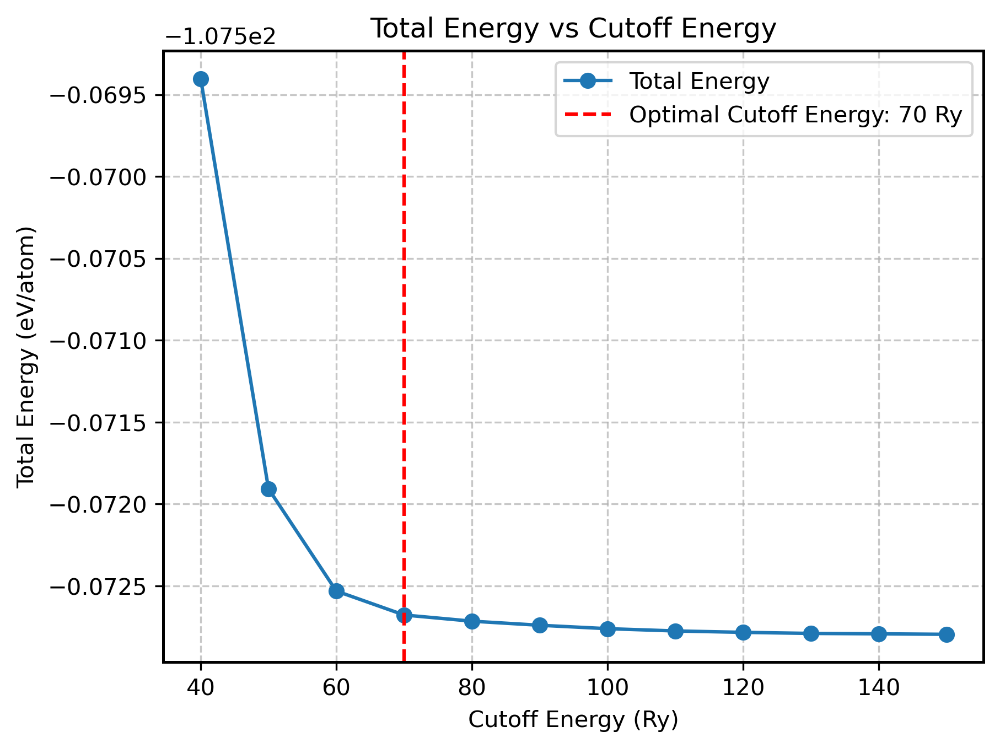

# band-pdos-workflow-QE
This repository provides a Python-based automated workflow for calculating the **band structure** and **projected density of states (PDOS)** of materials using **Quantum ESPRESSO** and **ASE**.
Simply provide a **CIF** file, and the workflow will handle everything from structure optimization to post-processing and visualization.


## Features
- Accepts CIF files as input.
- Automates structure optimization, SCF, NSCF, band structure, and PDOS calculations.
- Supports post-processing and visualization of results.
- Modular and extensible codebase.

## Table of Contents

- [K-Point Convergence Testing](#k-point)
- [Energy Cutoff Convergence Testing](#ecut)

## K-Point Convergence Testing
<a name="k-point"></a>

1. Navigate to the `test/kpoints_convergence_check` folder:

        cd test/kpoints_convergence_check/BN
   

2. Run the `run.sh` script with the required arguments:

        ./run.sh

3. The script will generate a plot (`kpoint_convergence.png`) showing the energy as a function of k-point grids.
   
   

4. For more information, refer to the inline documentation in the scripts:

   ```bash
   python cutoff_convergence.py --help

   
## Energy Cutoff Convergence Testing
<a name="ecut"></a>

1. Navigate to the `test/ecut_convergence_check` folder:

        cd test/ecut_convergence_check/Si
   

2. Run the `run.sh` script with the required arguments:

        ./run.sh

3. The script will generate a plot (`cutoff_convergence.png`) showing the energy as a function of k-point grids.
   
   
   
4. For more information, refer to the inline documentation in the scripts:

   ```bash
   python ecut_convergence.py --help
   
